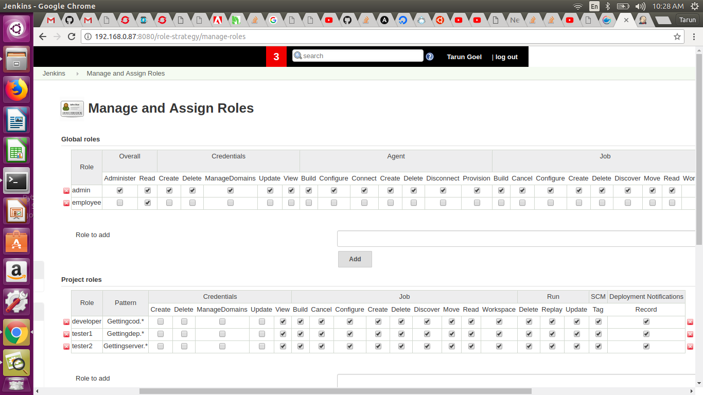

# Tasks

## Install Jenkins Role Based Plugin and assign different roles to different users.

### What is Jenkins Role based blugin?

#### It enables user authorization using a Role-Based strategy. Roles can be defined globally or for particular jobs or nodes selected by regular expressions. 

  

  
  

==============================================================================================================================================

## Clone git repo and perform CICD

### Steps to be performed using DSL job

  - Clone the repo in custom directory
  - Check code Stability
  - Check code Quality
  - Check code Coverage
  - Create a Pipeline to perform above tasks and deploy code

#### DSL to clone the repo in custom directory

job('Gettingcode') {  
label('vagrant')  
    customWorkspace('/home/vagrant/slave/workspace/taskworkspace/')  
    scm {  
      git{          
        remote  
	{    
         url('https://github.com/Team-A-Ninja/ContinuousIntegration.git')          
         }  
         branch('master')  
         }}  
	 steps{      
  shell('ls -la' ) 
}}      

----------------------------------------------------------------------------------------------------------------------------------------------

#### DSL to Check code Stability

mavenJob('Gettingcodeanalysis') {  
label('vagrant')  
  customWorkspace('/home/vagrant/slave/workspace/taskworkspace')  
    jdk('java-8')  
  goals('clean compile')  
       rootPOM("Spring3HibernateApp/pom.xml")  
        mavenInstallation('mvn-3.5.3')  
}   

----------------------------------------------------------------------------------------------------------------------------------------------

#### DSL to Check code Quality

mavenJob('Gettingcodeanalysis') {  
label('vagrant')  
  customWorkspace('/home/vagrant/slave/workspace/taskworkspace')  
    jdk('java-8')  
  goals('compile')  
    goals('findbugs:findbugs')  
  goals('checkstyle:checkstyle')  
       rootPOM("Spring3HibernateApp/pom.xml")  
        mavenInstallation('mvn-3.5.3')  
}  

----------------------------------------------------------------------------------------------------------------------------------------------

#### DSL to Check code Coverage

mavenJob('Gettingcodeanalysis') {  
label('vagrant')  
  customWorkspace('/home/vagrant/slave/workspace/taskworkspace')  
    jdk('java-8')  
  goals('install')  
  goals('cobertura:cobertura')  
       rootPOM("Spring3HibernateApp/pom.xml")  
        mavenInstallation('mvn-3.5.3')  
}  

----------------------------------------------------------------------------------------------------------------------------------------------

#### Deployment DSL

job('Gettingdeployment'){  
label('vagrant')  
  steps{  
  shell('scp /home/vagrant/slave/workspace/taskworkspace/Spring3HibernateApp/target/Spring3HibernateApp.war vagrant@192.168.0.87:/opt/tomcat/webapps')  
  }  
}  

----------------------------------------------------------------------------------------------------------------------------------------------

#### DSL to restart server after deployment

job('Gettingserverrestart') {  
label('label')  
    steps {  
        publishOverSsh {  
            server('192.168.0.87') {  
                transferSet {  
                    execCommand('sudo syatemctl restart tomcat')  
                }  
            }  
        }  
    }  
}  

----------------------------------------------------------------------------------------------------------------------------------------------

## Pipeline DSL for CD

node('vagrant'){  
    stage('getting code') {  
    build job: 'Gettingcode'  
    }  
    stage('codestability') {  
    build job: 'Gettingcodestability'  
    }  
    stage('codequality') {  
    build job: 'Gettingcodequality'  
    }  
    stage('code coverage') {  
    build job: 'Gettingcodeanalysis'  
    }  
    stage('deployement') {  
    build job: 'Gettingdeployment'  
    }  
    stage('serverrestart') {  
    build job: 'Gettingserverrestart'  
    }  
    
}  

  
  
  

----------------------------------------------------------------------------------------------------------------------------------------------

## Above task was performed by a master on slave machine

  

---------------------------------------------------------------------------------------------------------------------------
## Deployment

  

--------------------------------------------------------------------------------------------------------------------------

## 
